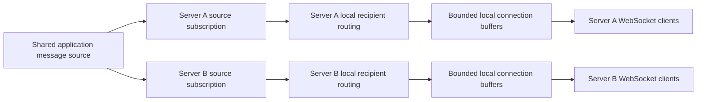

# Architecture

## Processing flow

Every active WebSocket server independently receives each cluster-wide notification from the shared source. On each server, the consuming application deserializes provider data into a `NotificationEnvelope`. The core checks expiry, resolves the union of local direct-user and subscription matches, serializes one JSON frame, and attempts a non-blocking write to each local recipient's bounded buffer. One loop per connection drains that buffer into its WebSocket.

## Responsibilities

- `WebSocketNotifications.Contracts` defines the neutral notification envelope.
- `WebSocketNotifications.Abstractions` defines application/provider boundaries for message sources, identity, authorization, and inbound application messages.
- `WebSocketNotifications.Configuration` owns public settings and validation.
- `WebSocketNotifications.Connections` owns in-memory connection indexes, buffers, socket loops, heartbeats, and session cleanup.
- `WebSocketNotifications.Delivery` owns recipient resolution, serialization, publishing, and programmatic subscription operations.
- `WebSocketNotifications.Protocol` parses the V1 client control protocol.
- `WebSocketNotifications.Hosting` supplies ASP.NET Core registration, endpoint mapping, and optional source-worker integration.

Provider-specific queue logic stays outside the core. Kafka consumer-group fan-out, commit/retry, RabbitMQ queue/exchange topology and ACK/NACK, deserialization, credentials, and connection management cannot leak into the notification library through `INotificationMessageSource`.

## Connection lifecycle

1. ASP.NET Core authenticates the endpoint request.
2. `IWebSocketUserResolver` returns the application's stable user ID.
3. The endpoint accepts the WebSocket and creates a connection ID.
4. The connection is indexed by ID and authenticated user.
5. One sender, one receiver, and—when enabled—one heartbeat loop run for the connection.
6. Completion or failure of any owned loop cancels the others.
7. Cleanup removes the connection and all its subscriptions atomically from the in-memory indexes.

Multiple connections can share one user ID. Direct-user notifications are routed to all connections in the snapshot.

## Subscription lifecycle

Opaque string subscription keys are attached to a connection. The library neither parses prefixes nor assigns category semantics. A client subscribe request is authorized before mutation. Application code can also manage a particular connection or every current connection for a user through `WebSocketNotificationHub`. Subscriptions end on explicit removal or connection cleanup; there is no TTL in V1.

Applications own key conventions and authorization, including tenant or partner namespacing such as `tenant:abc:group:premium`. Direct-user routing is not a subscription: `UserIds` are matched only against identity derived from the authenticated request, preventing a client from claiming another direct recipient through the protocol.

## Outbound flow

Direct-user and generic-subscription matches are unioned and deduplicated. Expired notifications produce no recipients. The notification is serialized once, checked against the configured outbound limit, and offered to each buffer without awaiting network I/O. Buffer overflow follows the configured slow-client policy. Each connection's single sender preserves its buffer order and is the only code that calls `WebSocket.SendAsync` for that socket.

## Inbound flow

The single receive loop assembles fragmented text messages within the inbound limit. Library messages handle subscribe, unsubscribe, and heartbeat pong operations. Other valid JSON objects are cloned and passed to the optional `IWebSocketInboundMessageHandler`. Binary and oversized messages close the connection with the corresponding WebSocket status.

## Concurrency and ownership

Connection and subscription indexes share one short critical section; no network operation or application callback occurs while it is held. Recipient queries return snapshots. Per-connection channels are bounded and have one reader. Session lifetime owns cancellation, task observation, channel completion, and registry cleanup.

## V1 multi-server deployment boundary

V1 uses source-level fan-out. Every simultaneously active WebSocket server independently receives each notification intended for cluster-wide delivery, then uses only its process-local connection and subscription indexes. A user or subscription may therefore match physical connections on several servers without any server resolving another server's state.

For Kafka, active servers require independent consumer groups. A shared group is invalid for this topology because Kafka delivers each record to one member of that group. The group name is `{application}.{environment}.{instance-id}`, where `instance-id` is unique to one active process incarnation. A restarted process receives a new identity and new group configured to start at the live end, so records emitted while the old process was offline are not replayed. Old ephemeral group metadata is left to the broker's configured retention/cleanup policy. Other providers must supply equivalent independent live subscriptions, such as one queue per active server bound to a fan-out exchange.

Server instance identity belongs to adapter/deployment configuration and never enters `NotificationEnvelope`. No Redis backplane, distributed presence registry, or targeted user/subscription-to-server resolution exists in V1.

`WebSocketNotificationHub.PublishAsync` is intentionally process-local. Cluster-wide delivery must enter through the shared source. Source readiness means the provider subscription is established and able to receive new notifications before the server advertises readiness. A restarted server must not replay notifications emitted while it was offline because V1 provides live delivery rather than an offline inbox.

The RC.1 Kafka sample does not yet meet this section: it uses a fixed group ID and lacks source-readiness and two-host proof. Those are implementation requirements for the multi-server fan-out stage before stable V1.
